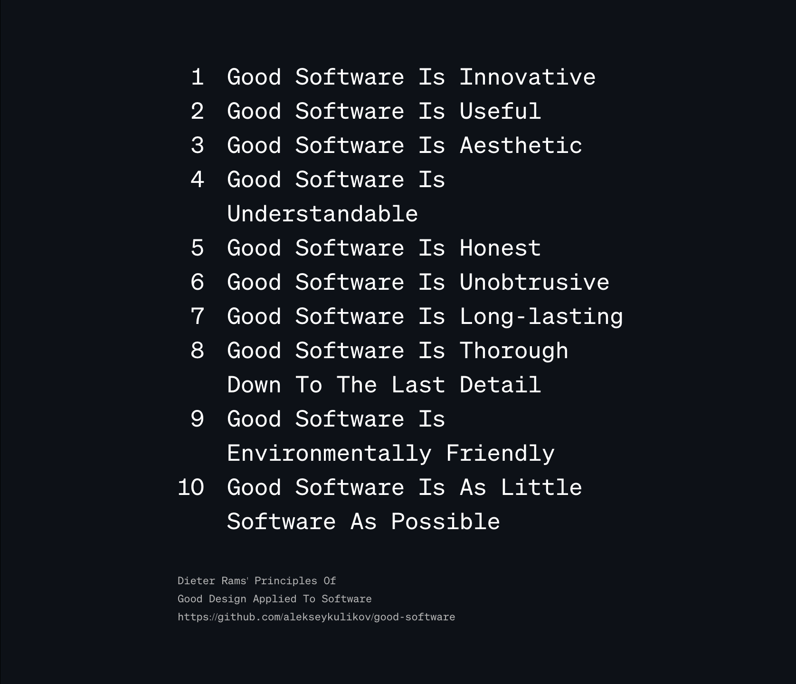

# Dieter Rams' [principles of good design](https://ifworlddesignguide.com/design-specials/dieter-rams-10-principles-for-good-design) applied to software

## 1. Good software is innovative

Rebuild old software using new technology. Build new software using old and stable technology.

Strive to bring something new into the world, even when building a clone. Observe the users for inspiration. Try to anticipate them: what will they really need next? 

## 2. Good software is useful

Software must be valuable to the user. It must make their lives better, by satisfying a need or solving a problem. Measure the value your software brings to its users and keep track of it. Make it break the build upon regression.

## 3. Good software is aesthetic

Take a moment to step back and look at your code. It should look beautiful to you. Beauty often embodies many useful properties. Code that pleases the eye is often readable, idiomatic, and expressive. We value these qualities as programmers.

## 4. Good software is understandable

Code isn't "clever" if no-one understands it. Clever code anticipates the questions and doubts of its maintainers. It is straightforward to others and your future self. It should be written firstly for people, and then for machines.

## 5. Good software is honest

Avoid abstractions you don't really need. Avoid cargo cult programming; strive to really understand the real reason for everything that you write in code. Be bold in exposing software metrics you are uncomfortable with, such as test coverage and anti-patterns. Let them break the build so you can find time or extra help to fix them.

## 6. Good software is unobtrusive

Be ruthless in removing any obstacle between your users and the best value they can get from your application.

Well designed applications are the fruit of many failed iterations, each proofed by real users. Be sure to observe your users as they interact with your application. Take note of any friction and frustration in using it. Their feedback is the most precious information you can get. Treat it honestly.

## 7. Good software is long-lasting

Future proof your software by planning for how its dependencies (browser environments, operating systems, etc.) will evolve during its lifetime. Avoid coupling it to perishable bindings. Offer to bundle its dependencies so it can better resist the entropy of innovation. Consider releasing its source code under a liberal license, so it can be rebuilt and enjoyed on future platforms.

## 8. Good software is thorough down to the last detail

Think deeply about every action your application performs. Ensure that it gracefully handles every error condition you can fathom, e.g. memory and storage exhaustion, race conditions, network errors, lack of permissions, etc.

Just like playing chess against yourself, always have a sandbox environment where you become the user. Be as strict and demanding with your application as you are towards other people's.

## 9. Good software is environmentally friendly

Avoid wasting computing power or storage. Consider the energy profile of your application as it grows. Use only what you need and give back the rest. If your application isn't performing useful work it should not be consuming resources: it should be inert. 

## 10. Good software is as little software as possible

Less code is always better. Be terse and expressive. Comments should be exceptional and treated like code. 

Resist the urge to over-engineer. Once your application is "barely good enough", it is complete. Completeness derives from (1) absence of defects, (2) conformance to the agreed requirements, (3) fitness for purpose. You need all three (and it's a lot of work) but nothing more.
